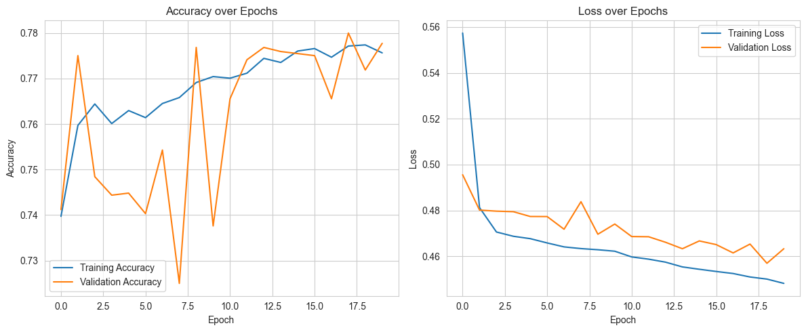
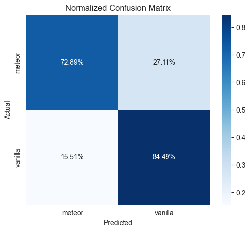
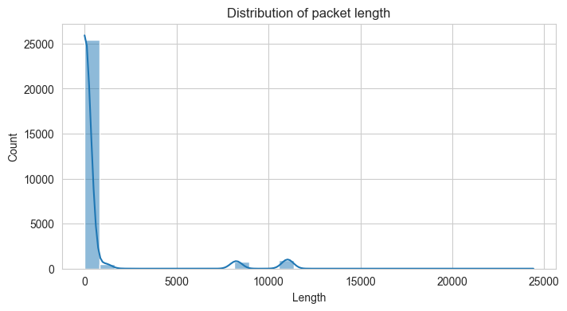
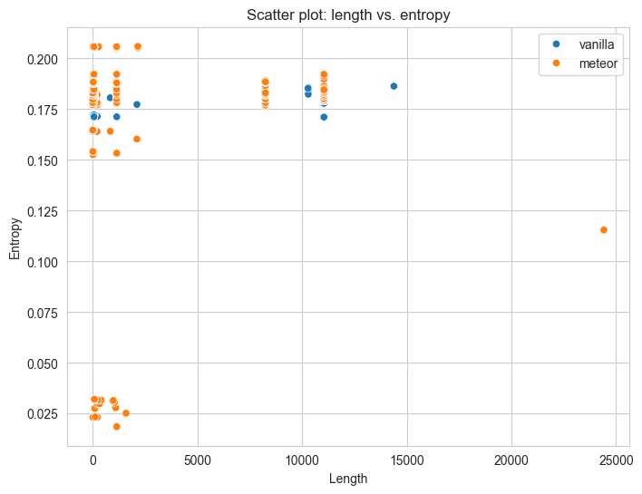

# ML Fingerprint Proxy Plugin

A Velocity plugin that uses machine learning to fingerprint and classify Minecraft clients as vanilla or modified clients.

## Overview

This plugin intercepts network packets from Minecraft clients, extracts features from these packets, and uses a machine learning model to classify clients as either vanilla Minecraft clients or modified clients. The classification is performed with a confidence level, allowing server administrators to identify potentially modified clients.

The plugin works by:
1. Intercepting network packets using PacketEvents
2. Extracting features from these packets (length, entropy, etc.)
3. Sending these features to a machine learning model via RabbitMQ
4. Receiving classification results from the model
5. Displaying client information to server administrators

## Features

- Real-time packet interception and analysis
- Feature extraction from network packets
- Machine learning-based client classification
- RabbitMQ integration for communication with ML model
- Regular client evaluation and information display

## Installation

1. Download the latest release from the releases page
2. Place the JAR file in your Velocity server's `plugins` directory
3. Start or restart your Velocity server
4. Configure the plugin as needed (see Configuration section)

## Configuration

The plugin uses a HOCON configuration file located at `plugins/ml_fingerprint/config.conf`. The default configuration is:

```hocon
rabbitMQ {
    host=localhost
    port=5672
    username=guest
    password=guest
    exchange=mlfingerprint
    queue=packets_queue
    routingKey=packets
    type=direct
    vhost=/
}

rabbitMQResult {
    queue=results_queue
    routingKey=results
}

# Interval in minutes between client evaluations
evaluationIntervalMinutes=1

# Interval in seconds for displaying client information
displayIntervalSeconds=1
```

### RabbitMQ Setup

The plugin requires a RabbitMQ server for communication with the ML model. You can use the provided Docker Compose file in the `rabbitmq` directory:

```bash
cd rabbitmq
docker-compose up -d
```

## Machine Learning Model

The plugin uses a dense multilayer perceptron (MLP) model for client classification. The model is trained on packet features extracted from known vanilla and modified clients.

### Model Training

The model is trained using the Jupyter notebooks in the `books` directory. The training process involves:

1. Collecting packet data from vanilla and modified clients
2. Extracting features from these packets
3. Training a dense MLP model on these features
4. Evaluating the model's performance

### Model Performance

The model achieves high accuracy in distinguishing between vanilla and modified clients:



The confusion matrix shows the model's classification performance:



### Feature Analysis

The plugin extracts several features from packets, including length and entropy. These features show clear differences between vanilla and modified clients:





## Usage

Once installed and configured, the plugin will automatically:

1. Intercept packets from clients
2. Extract features from these packets
3. Send these features to the ML model via RabbitMQ
4. Receive classification results
5. Display client information to server administrators

The plugin evaluates clients at regular intervals (configurable) and displays information about them, including:
- Client UUID
- Client type (vanilla or modified)
- Confidence level of the classification
- Number of packets processed

## Development

### Prerequisites

- Java 17 or higher
- Gradle
- RabbitMQ server
- Python with TensorFlow (for model training)

### Building

```bash
./gradlew build
```

### Running Tests

```bash
./gradlew test
```

## License

This project is licensed under the terms of the LICENSE file included in the repository.